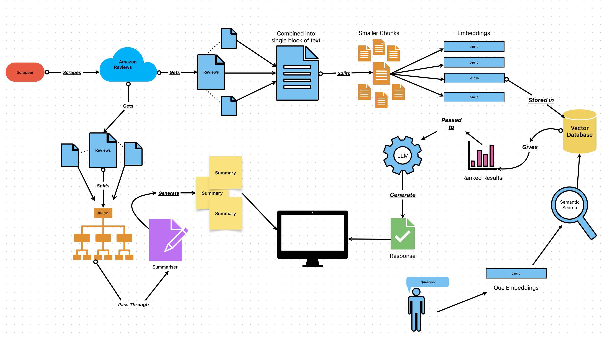
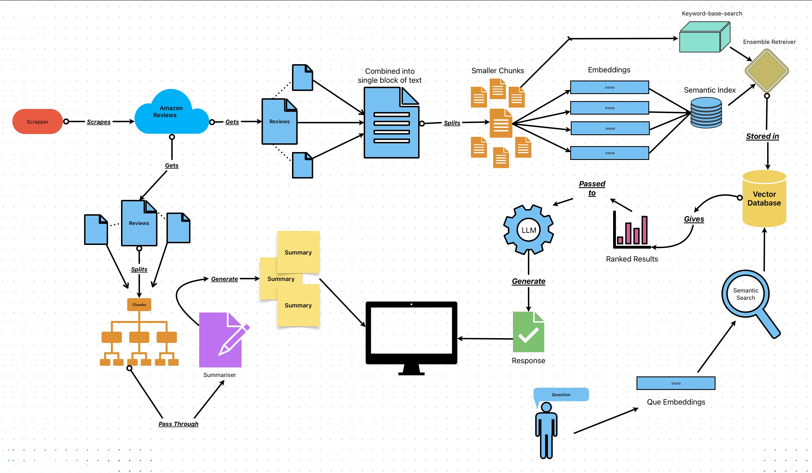

# 2nd Opinion - Your Personal Shopping Assistant

2nd Opinion is an AI-powered 🤖 application designed to help users make informed purchasing decisions 🛒 by analyzing product reviews and providing personalized recommendations. Whether you're buying a 💻, 📺, 📱, or any other product, 2nd Opinion has your back!

## Motivation
Have you ever found yourself spending hours reading through countless reviews, watching YouTube videos, or asking friends for advice before making a purchase? I know I have! This struggle inspired me to build **2nd Opinion**.

The idea came from my own experience of trying to choose between multiple products on Amazon. With so many options and reviews, it was overwhelming to make a decision. I realized that many people face the same challenge, and I wanted to create a solution that saves time and effort while providing reliable insights.

2nd Opinion is designed to:
- **Simplify Decision-Making**: By aggregating and summarizing reviews, it gives users a clear overview of each product.
- **Provide Personalized Assistance**: With **Peggy**, the AI assistant, users can ask questions, compare products, and get recommendations tailored to their needs.
- **Save Time and Effort**: No more scrolling through endless reviews or watching lengthy videos—2nd Opinion does the hard work for you.

## Features
- **Review Aggregation**: Scrapes and aggregates reviews from Amazon for multiple products using a custom-built **web scraper**.
- **Summarization**: Provides a concise summary of each product using a **deep learning-based summarizer** that processes customer reviews.
- **AI Assistant (Peggy)**: Powered by **hybrid search (Advanced RAG)**, Peggy answers user questions, compares products, and helps users make decisions.

## How It Works
1. Input the URLs of the products you're considering.
2. 2nd Opinion scrapes and aggregates reviews for all products.
3. Get a concise summary of each product based on customer feedback.
4. Chat with **Peggy**, the AI assistant, to ask questions, compare products, and make decisions.

## Technologies Used
- **Web Scraping**: Custom-built scraper to extract reviews from Amazon.
- **Summarization**: Deep learning models (e.g., Hugging Face Transformers) to generate concise summaries of product reviews.
- **AI Assistant (Peggy)**:
  - **Hybrid Search**: Combines **vector-based retrieval** (using embeddings) and **keyword-based retrieval** (BM25) for accurate and relevant results.
  - **Advanced RAG (Retrieval-Augmented Generation)**: Enhances Peggy's ability to provide well-reasoned and context-aware responses.
- **Streamlit**: For building the intuitive and user-friendly interface.

# Pipeline Architecture
### Traditional RAG Pipeline

The traditional RAG pipeline follows a sequential process where documents are embedded and retrieved based on pure vector similarity. While effective, this approach can sometimes miss relevant information that doesn't match exactly with the semantic similarity search.

### Enhanced Hybrid Search Pipeline

Hybrid search pipeline combines the best of both worlds:
- Vector-based similarity search for semantic understanding
- BM25 keyword matching for precise term retrieval
- Re-ranking mechanism to optimize result relevance
This dual approach ensures Peggy provides more accurate and comprehensive responses to your queries.

## Demo
Watch the demo video [here](demo.mp4).

## How to Run
1. Clone the repository:
   ```bash
   git clone https://github.com/Pardhasaradhi9/2nd-Opinion.git
2. Install dependencies:
   ```bash
   pip install -r requirements.txt
   ```
3. Run the Streamlit app:
   ```bash
   streamlit run strm_lit_app.py

## Future Enhancements
- Support for additional e-commerce platforms (e.g., eBay, Flipkart).
- Integration with YouTube reviews.
- User feedback mechanism to improve Peggy's responses.   

## Things worth mentioning
- Individual files are available for review scraping, product scraping, text summarisation, and text chatbot development.

## If you like the idea or work, please give a star. I’d be delighted to collaborate with others. Thank you! 🙏🏾 ✌🏽
